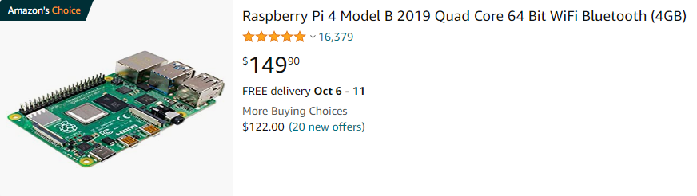

# pi_status #
Add I2C SD1306 Display and Lighted Momentary Pushbutton to Raspberry Pi

The inspiration for this project is from a UCTRONICS Pi Rack that [Jeff Geerling](https://youtu.be/akJ97oqmQlU "Jeff Geerling") reviewed on his YouTube channel. The UTRONICS product may be seen at [https://www.uctronics.com/cluster-and-rack-mount/for-raspberry-pi/1u-rack-mount/uctronics-pi-rack-pro-for-raspberry-pi-4b-19-1u-rack-mount-support-for-4-2-5-ssds.html](https://www.uctronics.com/cluster-and-rack-mount/for-raspberry-pi/1u-rack-mount/uctronics-pi-rack-pro-for-raspberry-pi-4b-19-1u-rack-mount-support-for-4-2-5-ssds.html).

## Materials ##

- SD1306 128x64 pixel display
- Lighted momentary switch (Normally Open (NO))
- 220 Ohm Resistor
- Raspberry Pi 4

## Wiring ##
<table>
	<tr>
		<th>Item</th>
		<th>Physical Pin</th>
		<th>GPIO/Function</th>
		<th>Note</th>
	</tr>
	<tr>
		<td>Display VCC</td>
		<td>1</td>
		<td>3v3</td>
		<td></td>
	</tr>
	<tr>
		<td>Display SDA</td>
		<td>3</td>
		<td>2 (SDA)</td>
		<td></td>
	</tr>
	<tr>
		<td>Display SCL</td>
		<td>5</td>
		<td>3 (SCL)</td>
		<td></td>
	</tr>
	<tr>
		<td>Display GND</td>
		<td>6</td>
		<td>GND</td>
		<td></td>
	</tr>
	<tr>
		<td>Switch</td>
		<td>7</td>
		<td>4</td>
		<td>Pulled High</td>
	</tr>
	<tr>
		<td>Switch</td>
		<td>9</td>
		<td>GND</td>
		<td></td>
	</tr>
	<tr>
		<td>LED+</td>
		<td>13</td>
		<td>27</td>
		<td>220 Ohm Resistor in Series</td>
	</tr>
	<tr>
		<td>LED-</td>
		<td>14</td>
		<td>GND</td>
		<td></td>
	</tr>
</table>

## Installation ##
1. Install Required Libraries (See [https://learn.adafruit.com/monochrome-oled-breakouts/python-setup](https://learn.adafruit.com/monochrome-oled-breakouts/python-setup))
	- sudo pip3 install adafruit-blinka
	- sudo pip3 install adafruit-circuitpython-ssd1306
2. Copy files to /home/pi/display
	- git clone https://github.com/richteel/pi_status.git
3. Run the script on reboot
	- sudo crontab -e
	- Add the following line to the end of the file @reboot sh /home/pi/pi_stats/display/launcher.sh 2>>/home/pi/pi_stats/display/logs/cron_err.txt 1>/home/pi/pi_stats/display/logs/cron_log.txt
4. Make the logs directory
	- mkdir /home/pi/pi_status/logs
5. Run the statement in the crontab to make certain that all is fine
	- sh /home/pi/pi_stats/display/launcher.sh 2>>/home/pi/pi_stats/display/logs/cron_err.txt 1>/home/pi/pi_stats/display/logs/cron_log.txt &
6. Reboot to see if all is working as expected
	- sudo reboot now

## Notes on the Running Script ##
You may want to stop the script or view the output of the script. First you will need to know the PID of the running script. Run the following to find the PID

- ps ax | grep 'code.py' | grep -v grep

You will see output similar to the following

<pre>pi@pi-one:~ $ ps ax | grep 'code.py' | grep -v grep
 403 ?        R     17:35 python3 /home/pi/display/code.py</pre>

From the output, we see that the PID is 403. We may now stop the script using the following command.

- sudo kill 403

We can view the error output by using the tail command.

- sudo tail -f /proc/403/fd/2

	or

- sudo tail -f /home/pi/display/logs/cron_err.txt

We can view the standard output by using the tail command.

- sudo tail -f /proc/403/fd/1

	or

- sudo tail -f /home/pi/display/logs/cron_log.txt

**NOTE**: Use CTRL + C to exit from the tail command.

# Operation #
The script addresses a few requirements for providing system status, script status, and shutting down of the Raspberry Pi.

## Screens ##
There are a few screens to provide system information. The screens are shown for 10 seconds each. Once the last screen is shown, the first screen is shown. The system information is refreshed before each screen is shown but is not updated while being displayed.

- **Splash screen**: Shown once to display software version information
- **NAME**: Displays the hostname of the Raspberry Pi
- **RAM**: Shows the total memory as well as the percentage of memory in use
- **TEMP**: Shows the CPU Temperature in degrees Celsius (NOTE: The scale shows the temperature between the operational limits of the Raspberry Pi, with the low end bring -40 C and the high end being 85 C)
- **DISK**: Shows the total disk space in GB and the percentage of disk space in use
- **CPU**: Shows the average percent load of the CPU over the last minute

## Switch ##
Pressing and holding the switch for 10 seconds will cause the Raspberry Pi to shutdown safely by issuing the shutdown command to the system.

## LED ##
The LED in the lighted switch will be lit when the script is running. If there is a delay from issuing the shutdown command and the script exiting, the LED will flash once every second. It is unlikely that you will see the LED flashing unless the operating system is busy with other tasks before signaling the script to terminate.

**NOTE**: The screen and the switch's LED will turn off when the script ends.

# Troubleshooting #
Here are some things to try to determine what may be an issue if the display or script fails.

1. Display not working and "ValueError: No I2C device at address: 0x3c" is shown in the cron_erros.txt log file 
	- Open a terminal and type the following command: 
i2cdetect -y 1  
If you see the following output, check your wiring to the display as the display was not found on the I2C bus. 
<pre>pi@pi-one:~ $ i2cdetect -y 1
     0  1  2  3  4  5  6  7  8  9  a  b  c  d  e  f
00:                         -- -- -- -- -- -- -- --
10: -- -- -- -- -- -- -- -- -- -- -- -- -- -- -- --
20: -- -- -- -- -- -- -- -- -- -- -- -- -- -- -- --
30: -- -- -- -- -- -- -- -- -- -- -- -- -- -- -- --
40: -- -- -- -- -- -- -- -- -- -- -- -- -- -- -- --
50: -- -- -- -- -- -- -- -- -- -- -- -- -- -- -- --
60: -- -- -- -- -- -- -- -- -- -- -- -- -- -- -- --
70: -- -- -- -- -- -- -- --
pi@pi-one:~ $
</pre> 
The expected output is the following showing a device was detected at address 3c, 
<pre>pi@pi-one:~ $ i2cdetect -y 1
     0  1  2  3  4  5  6  7  8  9  a  b  c  d  e  f
00:                         -- -- -- -- -- -- -- --
10: -- -- -- -- -- -- -- -- -- -- -- -- -- -- -- --
20: -- -- -- -- -- -- -- -- -- -- -- -- -- -- -- --
30: -- -- -- -- -- -- -- -- -- -- -- -- 3c -- -- --
40: -- -- -- -- -- -- -- -- -- -- -- -- -- -- -- --
50: -- -- -- -- -- -- -- -- -- -- -- -- -- -- -- --
60: -- -- -- -- -- -- -- -- -- -- -- -- -- -- -- --
70: -- -- -- -- -- -- -- --
pi@pi-one:~ $
</pre>

# 19" Rackmount Case #

As stated above, the inspiration for this project was the UCTRONICS Pi Rack. While I cannot build something as elegant as the UCTRONICS Pi Rack, I wanted to do something similar. I had a 1U ABS 19" Rack Mount Case, so I decided to replicate the UCTRONICS product. Below is some information on my build.

## Materials ##
- 19" ABS Rackmount Case 
	- Quantity: 1
	- Source: MPJA.COM
	- Product Page: [https://www.mpja.com/Rack-Mount-Case-ABS-Plastic-1U/productinfo/17086+BX/](https://www.mpja.com/Rack-Mount-Case-ABS-Plastic-1U/productinfo/17086+BX/)
- Draftboard 12" x 20" x 1/8" for mounting plate
	- Quantity: 1
	- Source: Glowforge
	- Product Page: [https://shop.glowforge.com/collections/draftboard/products/draftboard](https://shop.glowforge.com/collections/draftboard/products/draftboard)
- Clear Cast Acrylic Sheet 12" x 24" x 1/16"
	- Quantity: 1
	- Source: Inventables (23876-15)
	- Product Page: [https://www.inventables.com/technologies/clear-acrylic-sheet-cast](https://www.inventables.com/technologies/clear-acrylic-sheet-cast)
- SD1306 128x64 pixel - I2C OLED Display
	- Quantity: 4
	- Source: Amazon
	- Product Page: [https://smile.amazon.com/Frienda-Display-Self-Luminous-Compatible-Raspberry/dp/B08RYSVG5Y/](https://smile.amazon.com/Frienda-Display-Self-Luminous-Compatible-Raspberry/dp/B08RYSVG5Y/)
- Lighted Momentary Switch (Normally Open (NO))
	- Quantity: 4
	- Source: Amazon
	- Product Page: [https://smile.amazon.com/gp/product/B09JLG7T98/](https://smile.amazon.com/gp/product/B09JLG7T98/)
- 220 Ohm Resistor
	- Quantity: 4
	- Source: Amazon
	- Product Page: [https://smile.amazon.com/Projects-100EP514220R-220-Resistors-Pack/dp/B0185FGNWK/](https://smile.amazon.com/Projects-100EP514220R-220-Resistors-Pack/dp/B0185FGNWK/)
- Micro SD to Micro SD Card Extension Cable
	- Quantity: 4
	- Source: Amazon
	- Product Page: [https://smile.amazon.com/gp/product/B07WWVBK8V/](https://smile.amazon.com/gp/product/B07WWVBK8V/)
- Raspberry Pi 4
	- Quantity: 4
	- Source: PiShop.us
	- Product Page: [https://www.pishop.us/product/raspberry-pi-4-model-b-1gb/](https://www.pishop.us/product/raspberry-pi-4-model-b-1gb/)
- 2.54mm Double Row Male Header
	- Quantity: 4 (2x7 pins ea)
	- Source: Amazon
	- Product Page: [https://smile.amazon.com/uxcell-Straight-Connector-Arduino-Prototype/dp/B07DJYFGHX/](https://smile.amazon.com/uxcell-Straight-Connector-Arduino-Prototype/dp/B07DJYFGHX/)
- *(Optional)* Raspberry Pi PoE+ HAT
	- Quantity: 4
	- Source: PiShop.us
	- Product Page: [https://www.pishop.us/product/raspberry-pi-poe-plus-hat/](https://www.pishop.us/product/raspberry-pi-poe-plus-hat/)
- *(Optional)* SATA to USB Adapters
	- Quantity: 4 (Having a difficult time fitting to case)
	- Source: Amazon
	- Product Page: [https://smile.amazon.com/gp/product/B00HJZJI84/](https://smile.amazon.com/gp/product/B00HJZJI84/)

***NOTES***

- Source and product pages are representative of items. Materials may be sourced from other vendors such as Adafruit, Digi-Key, Mouser, etc.
- Currently (October 2022), Raspberry Pi boards are difficult to source. The situation should improve shortly. It is recommended that you use Raspberry Pi boards that you currently have or wait until they are available at approved vendors such as PiShop.us, Adafruit, Digi-Key, SparkFun, etc. You may be able to get a Raspberry Pi 4 at Amazon but it will be nearly triple the retail price. Below is the Amazon listing for a Raspberry Pi 4 with 4GB of RAM at $149.90 verses the retail price of $55 US.

You may find offical retailers with Raspberry Pi boards in stock by going to [https://rpilocator.com/](https://rpilocator.com/).

## Tools and Prerequisites ##
- Laser Cutter or hand tools for cutting mounting and front plates
- Ethernet Switch/Hub with PoE capability if using PoE+ Hat. If you plan to use PoE, your switch must support the IEEE 802.3at standard. *(See Jeff Geerling's video [Review: Raspberry Pi's new PoE+ HAT](https://youtu.be/XZ08QKAbBoU "Review: Raspberry Pi's new PoE+ HAT"))*

### Laser Cutting Files ###
There are two files located in the case folder for use with a laser cutter. The front panel will be having some changes shortly so be warned if you decide to use it that it will not fit properly. I had only 1/8" material so it is smaller to fit the case for testing. I now have 1/16" stock and will be modifying the file for the 1/16" material to fit properly in the case. I will also modify the notch for the USB to SATA adapter cable. I'm considering running them on top of the mounting plate rather than under it as it is not a good fit. If I do that, I may move the SD Card slot back to the center to avoid running it over a mounting hole.
